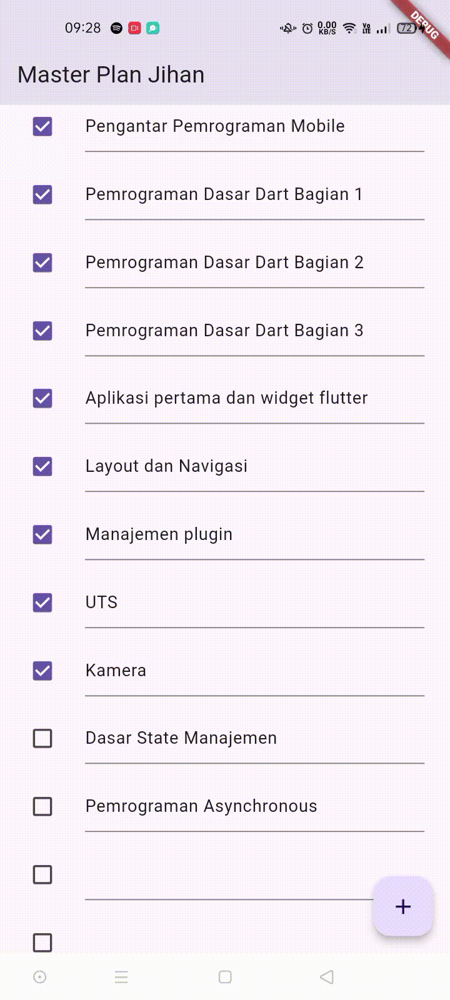
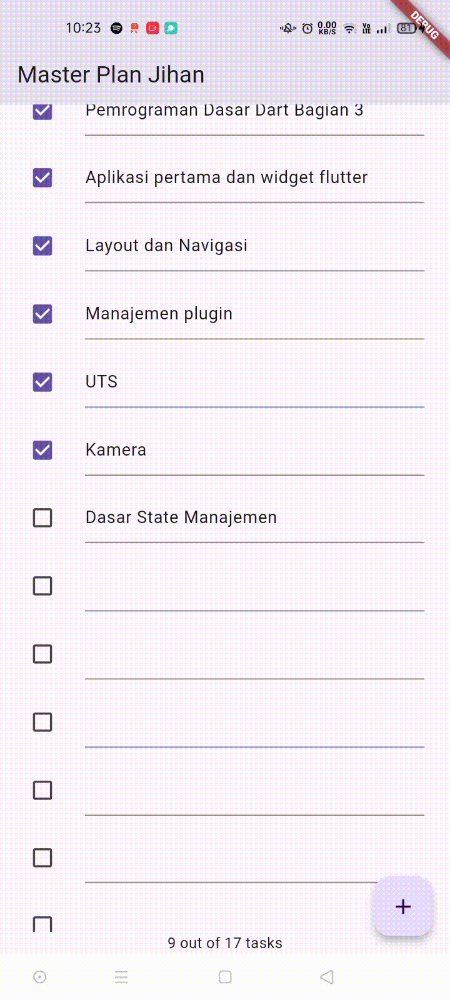

### Jihan Karunia Putri <br> 2241720031 / 13 / TI-3B

# Tugas Praktikum 1: Dasar State dengan Model-View

1. Selesaikan langkah-langkah praktikum tersebut, lalu dokumentasikan berupa GIF hasil akhir praktikum beserta penjelasannya di file README.md! Jika Anda menemukan ada yang error atau tidak berjalan dengan baik, silakan diperbaiki.

    
- Penjelasan:<br>
Aplikasi **Master Plan** yang telah dibuat merupakan sebuah aplikasi to-do sederhana dengan tampilan yang intuitif dan responsif. Pengguna dapat dengan mudah menambahkan tugas baru melalui tombol FloatingActionButton, dan setiap tugas ditampilkan dalam bentuk daftar yang dapat di-scroll. Setiap item tugas dilengkapi dengan Checkbox untuk menandai status tugas dan TextFormField untuk mengedit deskripsi. Selain itu, aplikasi dirancang untuk mengatasi masalah interaksi saat keyboard muncul, sehingga pengguna tetap dapat mengakses dan mengedit tugas yang berada di bagian bawah layar tanpa kendala.<br><br>

2. Jelaskan maksud dari langkah 4 pada praktikum tersebut! Mengapa dilakukan demikian?
- Jawab:<br>
Langkah 4 bertujuan untuk menyederhanakan proses pengelolaan dan pengimporan model dalam aplikasi dengan membuat sebuah file bernama data_layer.dart. File ini berfungsi sebagai wrapper atau gateway untuk beberapa model (dalam kasus ini plan.dart dan task.dart) yang dibutuhkan pada lapisan data (data layer) aplikasi. Dengan menyatukan impor model-model tersebut di satu tempat, kode menjadi lebih ringkas dan lebih mudah dikelola saat aplikasi berkembang. Contoh:

    ```dart
    // file: models/data_layer.dart
    export 'plan.dart';
    export 'task.dart';
    ```

    Lalu, misalkan kita membutuhkan akses ke model Plan atau Task di sebuah file lain, cukup dengan mengimpor `data_layer.dart`, yaiutu: `import 'models/data_layer.dart';`. Dengan demikian, Plan dan Task sudah tersedia dan dapat langsung digunakan tanpa perlu mengimpor plan.dart dan task.dart secara terpisah.<br><br>

3. Mengapa perlu variabel plan di langkah 6 pada praktikum tersebut? Mengapa dibuat konstanta ?
- Jawab:<br>
Pada langkah 6, variabel plan digunakan untuk menyimpan data dari objek Plan yang akan dikelola dan ditampilkan di layar. Variabel ini memudahkan kita untuk mengakses dan memanipulasi data yang terkait dengan *plan* (rencana) dalam antarmuka pengguna, terutama saat pengguna menambahkan, mengubah, atau menghapus *task* (tugas) dalam aplikasi.<br>
Plan dibuat sebagai **konstanta** `(const Plan())` untuk efisiensi dan keamanan data. Dengan menjadikannya konstanta, Dart hanya mengalokasikan memori sekali, sehingga lebih hemat. Selain itu, konstanta mencegah perubahan tidak sengaja pada nilai awal plan, menjaga konsistensi data selama aplikasi berjalan. Ini juga mendukung konsep immutability yang meningkatkan performa aplikasi dengan memungkinkan Dart melakukan optimisasi lebih lanjut.<br><br>

4. Lakukan capture hasil dari Langkah 9 berupa GIF, kemudian jelaskan apa yang telah Anda buat!
    
- Penjelasan:
Dari langkah 1 hingga 9 dalam praktikum ini, sebuah aplikasi to-do sederhana bernama **Master Plan** telah dibangun menggunakan Flutter. Pada langkah pertama, proyek baru dibuat dan struktur folder diatur untuk menjaga keteraturan kode. Selanjutnya, di langkah 2 dan 3, dua model data, yaitu `Task` dan `Plan`, dibuat untuk menyimpan informasi tentang tugas dan rencana, masing-masing dengan atribut yang relevan. Di langkah 4, proses impor disederhanakan dengan membuat file `data_layer.dart` yang mengekspor kedua model tersebut. Langkah 5 berfokus pada menyiapkan entry point aplikasi di `main.dart`, di mana aplikasi dideklarasikan dengan tema dan layar utama. Kemudian, di langkah 6, kelas `PlanScreen` dibuat menggunakan StatefulWidget, yang menjadi layar utama aplikasi, dan di langkah 7, metode `_buildAddTaskButton()` ditambahkan untuk memungkinkan pengguna menambahkan tugas baru dengan menekan tombol. Pada langkah 8, widget `ListView.builder` dibuat untuk menampilkan daftar tugas secara dinamis, dan di langkah 9, widget `_buildTaskTile` dikembangkan untuk menampilkan setiap tugas dengan Checkbox untuk menandai status tugas dan TextFormField untuk mengedit deskripsi tugas.<br><br>

5. Apa kegunaan method pada Langkah 11 dan 13 dalam lifecyle state ?
- Jawab:<br>
Pada langkah 11, method `initState()` digunakan untuk menginisialisasi state widget saat widget pertama kali dimuat. Dalam konteks ini, method ini menambahkan listener pada `scrollController` yang memungkinkan aplikasi untuk menghilangkan fokus dari elemen input ketika pengguna menggulir. Ini berguna untuk meningkatkan pengalaman pengguna, karena mencegah keyboard virtual tetap muncul ketika menggulir.<br>
Sedangkan pada langkah 13, method `dispose()` berfungsi untuk membersihkan sumber daya yang digunakan oleh widget ketika widget tersebut dihapus dari tree widget. Dalam hal ini, `dispose()` digunakan untuk memanggil `scrollController.dispose()`, yang menghapus listener yang telah ditambahkan dan membebaskan memori yang digunakan oleh `scrollController`. Ini penting untuk mencegah kebocoran memori dan memastikan aplikasi berjalan dengan efisien, terutama saat berinteraksi dengan banyak widget atau saat mengubah state aplikasi.
<br><br>

# Tugas Praktikum 2: InheritedWidget

2. Jelaskan mana yang dimaksud InheritedWidget pada langkah 1 tersebut! Mengapa yang digunakan InheritedNotifier?
- Jawab:<br>
Pada langkah pertama, yang dimaksud dengan InheritedWidget adalah kelas dasar yang digunakan untuk meneruskan data ke widget turunannya dalam pohon widget Flutter. Dalam hal ini, kelas `PlanProvider` didefinisikan sebagai subclass dari `InheritedNotifier<ValueNotifier<Plan>>`. Ini berarti `PlanProvider` tidak hanya dapat menyimpan dan meneruskan data (dalam bentuk `ValueNotifier<Plan>`) tetapi juga memberi tahu widget lain ketika data tersebut berubah. Dengan menggunakan InheritedNotifier, setiap kali nilai dalam `ValueNotifier<Plan>` berubah, widget yang tergantung padanya akan secara otomatis diperbarui. Ini memungkinkan pembaruan UI yang lebih efisien dan responsif tanpa memerlukan pengelolaan state yang lebih kompleks.<br><br>

3. Jelaskan maksud dari method di langkah 3 pada praktikum tersebut! Mengapa dilakukan demikian?
- Jawab:<br>
Pada langkah 3, terdapat penambahan dua method dalam model kelas `Plan`, yaitu `completedCount` dan `completenessMessage`. 
    1. Method `completedCount` menghitung jumlah tugas yang telah diselesaikan dengan menyaring daftar tugas (tasks) berdasarkan properti complete. Ini memungkinkan pengguna untuk melihat seberapa banyak tugas yang telah mereka selesaikan.
    2. Method `completenessMessage` menghasilkan string yang menyajikan perbandingan antara jumlah tugas yang telah diselesaikan dan total tugas yang ada, memberikan konteks jelas bagi pengguna, seperti "3 out of 10 tasks."

    Penambahan method ini memisahkan logika perhitungan dari tampilan, meningkatkan keterbacaan dan organisasi kode, serta memungkinkan UI untuk secara dinamis memperbarui informasi tentang status tugas setiap kali ada perubahan. Ini menciptakan aplikasi yang lebih modular dan mudah di-maintain, sekaligus mengurangi kemungkinan kesalahan.

4. Lakukan capture hasil dari Langkah 9 berupa GIF, kemudian jelaskan apa yang telah Anda buat!<br>
    
- Penjelasan:<br>
Praktikum 2 bertujuan untuk mengelola data dengan menggunakan `InheritedWidget` dan `InheritedNotifier` di dalam aplikasi Flutter. Dalam praktikum ini, sebuah class `PlanProvider` diciptakan untuk mengelola state dan data dari todo list secara terpisah dari UI. Dengan menggunakan `ValueNotifier`, class ini memungkinkan notifikasi untuk memberitahukan widget yang bergantung pada data ketika ada perubahan. Dua method baru ditambahkan dalam model `Plan`, yaitu `completedCount` untuk menghitung jumlah tugas yang telah selesai dan `completenessMessage` untuk memberikan informasi mengenai progres tugas yang ada. Hal ini bertujuan agar tampilan dapat mencerminkan data yang dikelola dengan lebih baik dan terpisah dari logika aplikasi.
<br><br>