### Jihan Karunia Putri <br> 2241720031 / 13 / TI-3B

# Pemrograman Asynchronous
## Praktikum 1: Mengunduh Data dari Web Service (API)
#### Soal 1 
Tambahkan nama panggilan Anda pada title app sebagai identitas hasil pekerjaan Anda.
```dart
import 'dart:async';
import 'package:flutter/material.dart';
import 'package:http/http.dart';
import 'package:http/http.dart' as http;

void main() {
  runApp(const MyApp());
}

class MyApp extends StatelessWidget {
  const MyApp({super.key});

  @override
  Widget build(BuildContext context) {
    return MaterialApp(
      title: 'Flutter Demo - Jihan',
      theme: ThemeData(
        primarySwatch: Colors.blue,
        visualDensity: VisualDensity.adaptivePlatformDensity,
      ),
      home: const FuturePage(),
    );
  }
}

class FuturePage extends StatefulWidget {
  const FuturePage({super.key});

  @override
  State<FuturePage> createState() => _FuturePageState();
}

class _FuturePageState extends State<FuturePage> {
  String result = '';
  @override
  Widget build(BuildContext context) {
    return Scaffold(
      appBar: AppBar(
        title: const Text('Back from the Future - Jihan'),
      ),
      body: Center(
        child: Column(
          children: [
            const Spacer(),
            ElevatedButton(
              child: const Text('GO!'),
              onPressed: () {},
            ),
            const Spacer(),
            Text(result),
            const Spacer(),
            const CircularProgressIndicator(),
            const Spacer(),
          ],
        ),
      ),
    );
  }
}
```

#### Soal 2
- Carilah judul buku favorit Anda di Google Books, lalu ganti ID buku pada variabel path di kode tersebut.

    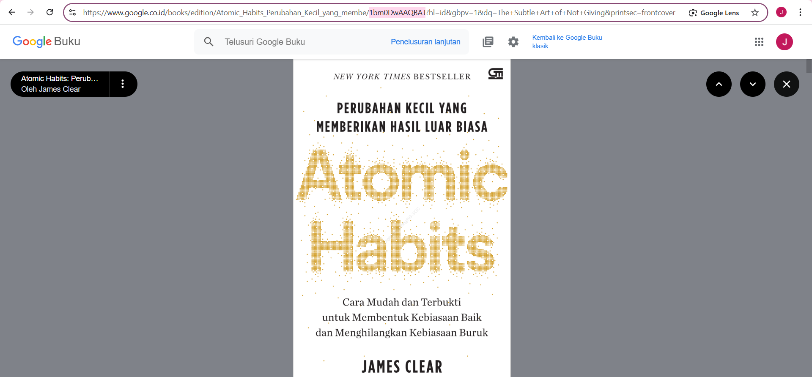

- Kemudian cobalah akses di browser URI tersebut dengan lengkap seperti ini. Jika menampilkan data JSON, maka Anda telah berhasil. Lakukan capture milik Anda dan tulis di README pada laporan praktikum.

    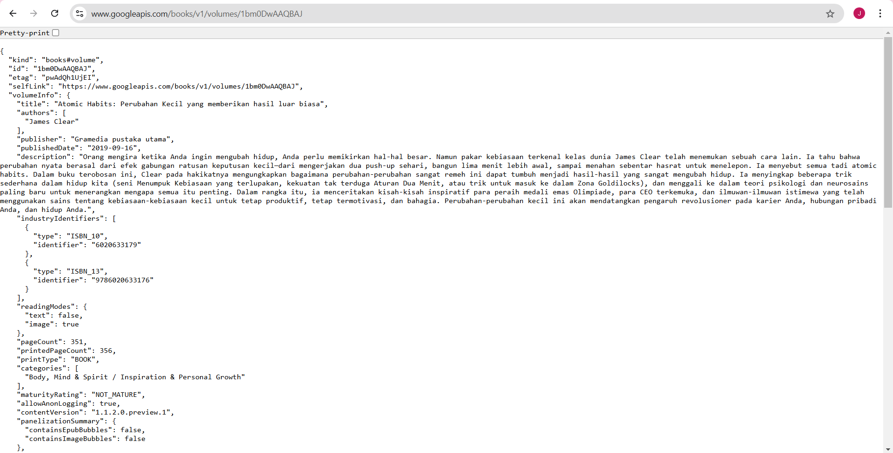

#### Soal 3
1. Jelaskan maksud kode langkah 5 tersebut terkait substring dan catchError!
- Jawab:<br>
Pada kode tersebut, fungsi `onPressed` dari `ElevatedButton` digunakan untuk menjalankan proses asynchronous `getData()` yang mengambil data dari sumber tertentu.
    1. Substring:
    Setelah data berhasil diambil melalui `getData()`, hasilnya diproses dalam blok `.then((value) { ... })`. Dalam blok ini, nilai `value.body` (asumsi ini adalah respon dari server) diubah menjadi string dan kemudian hanya bagian awalnya (450 karakter pertama) yang disimpan di dalam variabel `result` menggunakan `substring(0, 450)`. Ini dilakukan dengan `value.body.toString().substring(0, 450);`, yang membatasi tampilan data agar tidak terlalu panjang.
    2. catchError:
    Blok `catchError` digunakan untuk menangani situasi di mana terjadi kesalahan saat mengambil data melalui `getData()`. Jika terjadi error, blok `catchError` akan dieksekusi, dan variabel `result` akan diatur menjadi `'An error occurred'`. Kemudian, `setState()` dipanggil kembali untuk memperbarui tampilan dengan pesan kesalahan ini.

    Secara keseluruhan, `substring` membatasi panjang teks yang ditampilkan, sementara `catchError` memastikan aplikasi tidak crash dan tetap memberi umpan balik pengguna jika terjadi kesalahan.

2. Capture hasil praktikum Anda berupa GIF dan lampirkan di README.

    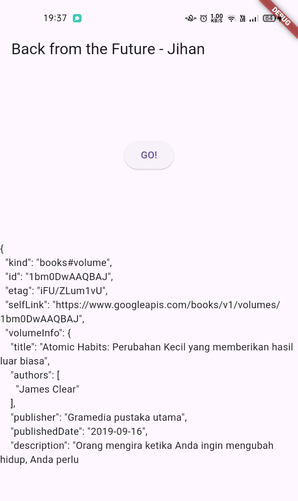
<br><br>

## Praktikum 2: Menggunakan await/async untuk menghindari callbacks
#### Soal 4
1. Jelaskan maksud kode langkah 1 dan 2 tersebut!
- Jawab:<br>
    1. Langkah 1
    Pada langkah ini, tiga metode asinkron `returnOneAsync`, `returnTwoAsync`, dan `returnThreeAsync` ditambahkan ke dalam kelas `_FuturePageState`. Setiap metode mengembalikan nilai integer setelah penundaan 3 detik. Penjelasannya adalah sebagai berikut:
        - `returnOneAsync`: Metode ini menunda eksekusi selama 3 detik dengan `await Future.delayed(const Duration(seconds: 3));`, lalu mengembalikan nilai `1`.
        - `returnTwoAsync`: Serupa dengan `returnOneAsync`, metode ini juga menunda eksekusi selama 3 detik dan mengembalikan nilai `2`.
        - `returnThreeAsync`: Metode ini menunda eksekusi selama 3 detik dan mengembalikan nilai `3`.
 
       Ketiga metode ini digunakan untuk simulasi proses asinkron yang memakan waktu, seperti panggilan ke server atau pemrosesan data yang lambat.

    2. Langkah 2
    Pada langkah ini, metode `count()` ditambahkan. Metode ini menjalankan ketiga metode asinkron di atas secara berurutan dan menjumlahkan hasilnya.
        - `int total = 0;` menginisialisasi variabel total dengan nilai 0.
        - `total = await returnOneAsync();`: Menunggu hasil dari `returnOneAsync` dan menetapkan total dengan nilai hasilnya (1).
        - `total += await returnTwoAsync();`: Menunggu hasil dari `returnTwoAsync` dan menambahkan nilai hasilnya (2) ke total, sehingga total sekarang menjadi 3.
        - `total += await returnThreeAsync();`: Menunggu hasil dari `returnThreeAsync` dan menambahkan nilai hasilnya (3) ke total, sehingga total sekarang menjadi 6.
        - `setState()`: Setelah perhitungan selesai, `setState()` dipanggil untuk memperbarui variabel `result` dengan nilai akhir total (6) yang akan ditampilkan pada UI.

        Jadi, metode `count()` menjalankan ketiga metode asinkron secara berurutan dan mengakumulasikan hasilnya untuk ditampilkan pada UI setelah semua operasi selesai.

2. Capture hasil praktikum Anda berupa GIF dan lampirkan di README.

    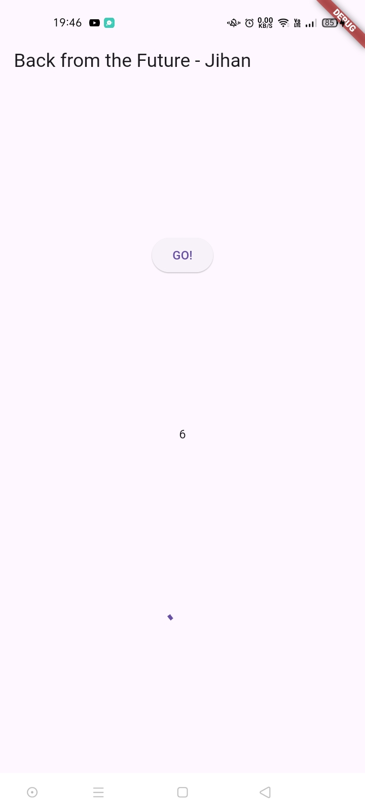
<br><br>

## Praktikum 3: Menggunakan Completer di Future
#### Soal 5
1. Jelaskan maksud kode langkah 2 tersebut!
- Jawab: <br>
Pada langkah 2, variabel `Completer` dan dua metode `getNumber()` serta `calculate()` ditambahkan ke dalam kelas `_FuturePageState`.
    - `Completer`: Variabel `Completer` digunakan untuk membuat `Future` yang bisa diselesaikan secara manual.
    - `getNumber()`: Inisialisasi `Completer`, memulai metode `calculate()`, dan mengembalikan `Future` yang akan selesai nanti.
    - `calculate()`: Menunda eksekusi 5 detik, lalu menyelesaikan `Future` dengan nilai `42` menggunakan `completer.complete(42);`.

    Sehingga, `getNumber()` menghasilkan `Future` yang akan selesai setelah `calculate()` selesai (dalam 5 detik) dengan nilai `42`.

2. Capture hasil praktikum Anda berupa GIF dan lampirkan di README.

    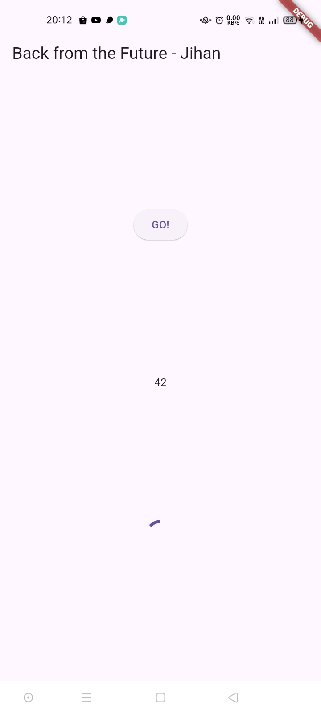

#### Soal 6
1. Jelaskan maksud perbedaan kode langkah 2 dengan langkah 5-6 tersebut!
- Jawab: <br>
Perbedaan utama antara langkah 2 dan langkah 5-6 adalah pada penanganan error dan cara memanfaatkan `Completer` dalam `calculate()` serta penggunaan hasilnya di `onPressed()`.
    1. Langkah 2:
    - `calculate()` hanya menunggu 5 detik lalu menyelesaikan `Completer` dengan nilai `42` tanpa penanganan error.
    - `getNumber()` hanya menghasilkan nilai `42` setelah menunggu, tanpa antisipasi kesalahan.
    2. Langkah 5-6:
    - `calculate()` diubah agar lebih tangguh dengan menambahkan blok `try-catch`. Jika ada error, `completer.completeError({})` dipanggil untuk menandai error.
    - Pada `onPressed()`, `getNumber()` dipanggil dengan `.then(...)` dan `.catchError(...)` untuk menangani hasil sukses (meng-update `result` dengan nilai) atau error (menampilkan pesan error).

2. Capture hasil praktikum Anda berupa GIF dan lampirkan di README.

    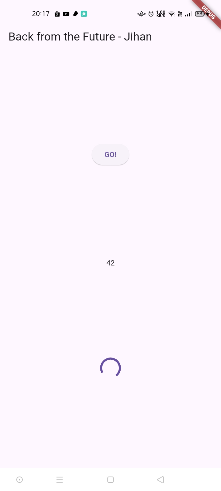
<br><br>

## Praktikum 4: Memanggil Future secara paralel
#### Soal 7
Capture hasil praktikum Anda berupa GIF dan lampirkan di README. <br>
    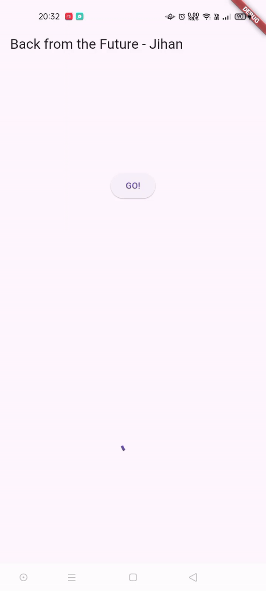

#### Soal 8
Jelaskan maksud perbedaan kode langkah 1 dan 4!
- Jawab: <br>
Pada langkah 1, metode `returnFG()` membuat grup `FutureGroup<int>`, yang berfungsi untuk mengelola beberapa Future secara bersamaan. Tiga Future — `returnOneAsync()`, `returnTwoAsync()`, dan `returnThreeAsync()` — ditambahkan ke grup menggunakan `futureGroup.add()`, kemudian `futureGroup.close()` dipanggil untuk menutup grup dan menjalankan semua Future secara paralel. Setelah semua Future selesai, `futureGroup.future.then(...)` digunakan untuk mengakses hasil sebagai daftar `List<int>`. Hasil ini dijumlahkan dalam perulangan for, dan totalnya disimpan ke dalam variabel result untuk diperbarui di UI menggunakan `setState()`.
Pada langkah 4, FutureGroup digantikan dengan `Future.wait`, yang lebih sederhana untuk mengelola beberapa Future. Tiga Future (`returnOneAsync()`, `returnTwoAsync()`, dan `returnThreeAsync()`) dimasukkan ke dalam `Future.wait` sebagai daftar dan langsung dijalankan bersamaan. Ketika semua Future selesai, `Future.wait` mengembalikan hasil sebagai `List<int>`, yang dapat langsung diproses tanpa memerlukan penutupan atau pengelompokan tambahan. Ini membuat langkah 4 lebih efisien dan mudah dibaca.

## Praktikum 5: Menangani Respon Error pada Async Code 

#### Soal 9 <br>
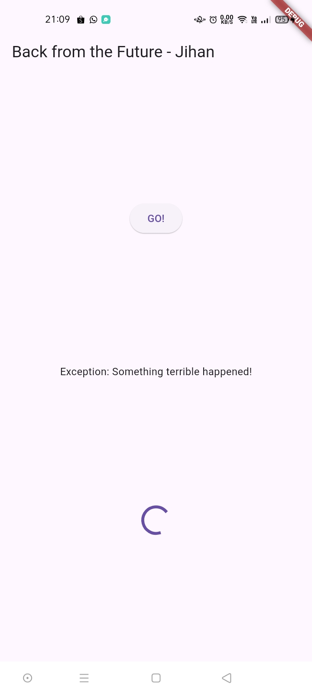
<br><br>
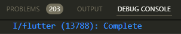

#### Soal 10
Panggil method handleError() tersebut di ElevatedButton, lalu run. Apa hasilnya? Jelaskan perbedaan kode langkah 1 dan 4!
- Hasil:<br>
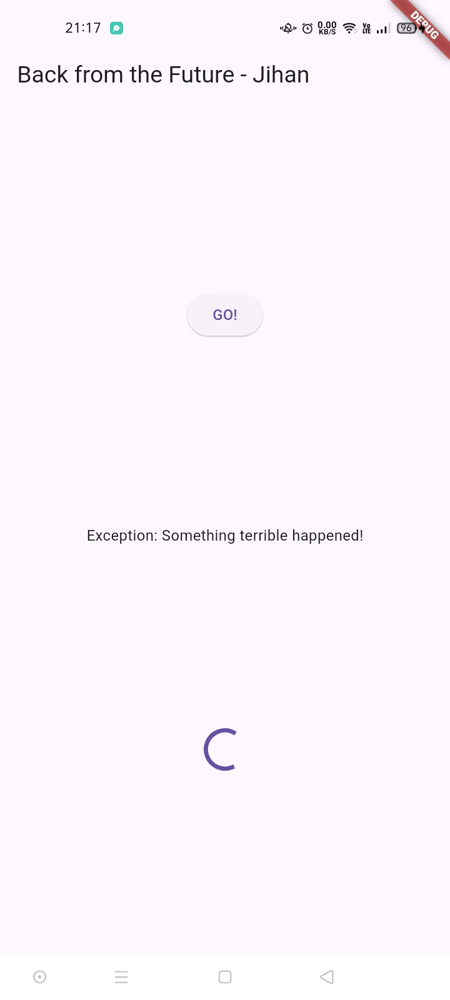 

    Ketika tombol `ElevatedButton` ditekan, metode `handleError()` akan dipanggil. Kode ini mencoba menjalankan `returnError()`, yang menunggu selama 2 detik sebelum melempar sebuah Exception dengan pesan "Something terrible happened!". Dalam `handleError()`, blok try-catch menangkap error tersebut, lalu memperbarui variabel result dengan pesan error dan memanggil `setState()` untuk memperbarui UI dengan pesan error yang muncul di layar. Setelah itu, blok finally akan mencetak "Complete" di konsol.

- Perbedaan:<br>
Perbedaan antara kode langkah 1 dan 4 terletak pada bagaimana error dikelola. Pada langkah 1, metode `returnError()` hanya mendefinisikan situasi di mana error akan terjadi dengan menunggu selama 2 detik sebelum melempar Exception, tanpa adanya penanganan error. Sebaliknya, langkah 4 memperkenalkan metode `handleError()` yang secara aktif menangani error yang mungkin muncul dari pemanggilan `returnError()`. Metode ini menggunakan blok try-catch-finally untuk mencoba menjalankan `returnError()`, menangkap error di blok catch, dan memperbarui antarmuka pengguna dengan pesan error. Selain itu, blok finally memastikan bahwa log “Complete” dicetak di konsol, terlepas dari apakah error terjadi. Dengan demikian, langkah 1 berfokus pada pemicu error, sementara langkah 4 berfokus pada penanganan dan penyampaian pesan error tersebut.

## Praktikum 6: Menggunakan Future dengan StatefulWidget

#### Soal 11
Tambahkan nama panggilan Anda pada tiap properti title sebagai identitas pekerjaan Anda.
```dart
import 'package: flutter/material.dart'; 
import 'package: geolocator/geolocator.dart';

class LocationScreen extends Statefulwidget {
  const LocationScreen ({ super.key});

  @override
  State<LocationScreen> createState() => _LocationScreenState();
}

class _LocationScreenState extends State<LocationScreen> {
  String myPosition = '';
  @override
  void initState() {
  super.initState();
  getPosition().then((Position myPos) {
    myPosition =
      'Latitude: ${myPos.latitude.toString()} - Longitude:{myPos.longitude.toString()}';
    setState(() {
      myPosition = myPosition;
    });
} );
}

@override
Widget build(BuildContext context) {
  return Scaffold(
    appBar: AppBar(title: const Text('Current Location - Jihan')),
    body: Center (child: Text (myPosition)),
  );
}

Future<Position> getPosition() async {
  await Geolocator.requestPermission();
  await Geolocator.isLocationServiceEnabled(); 
  Position? position =
    await Geolocator. getCurrentPosition();
  return position;
}}
```

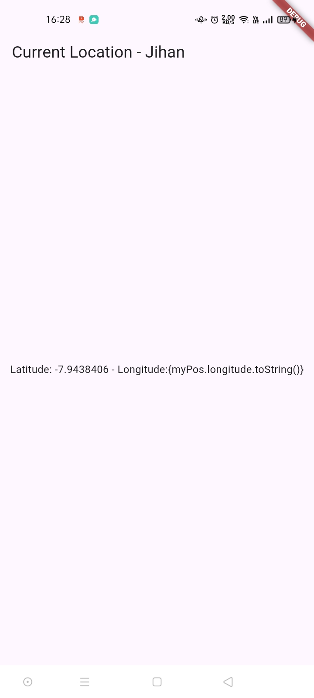 

#### Soal 12
- Apakah Anda mendapatkan koordinat GPS ketika run di browser? Mengapa demikian?<br>
Jawab:<br>
Tidak sepenuhnya, hanya latitude yang berhasil ditampilkan, sedangkan longitude mengalami kesalahan tampilan akibat penggunaan string literal yang kurang tepat. Masalah ini terjadi karena bagian longitude seharusnya ditulis menggunakan interpolasi string yang benar di kode. Perlu menggunakan ${} agar Flutter menampilkan nilai dari variabel tersebut dengan benar.

  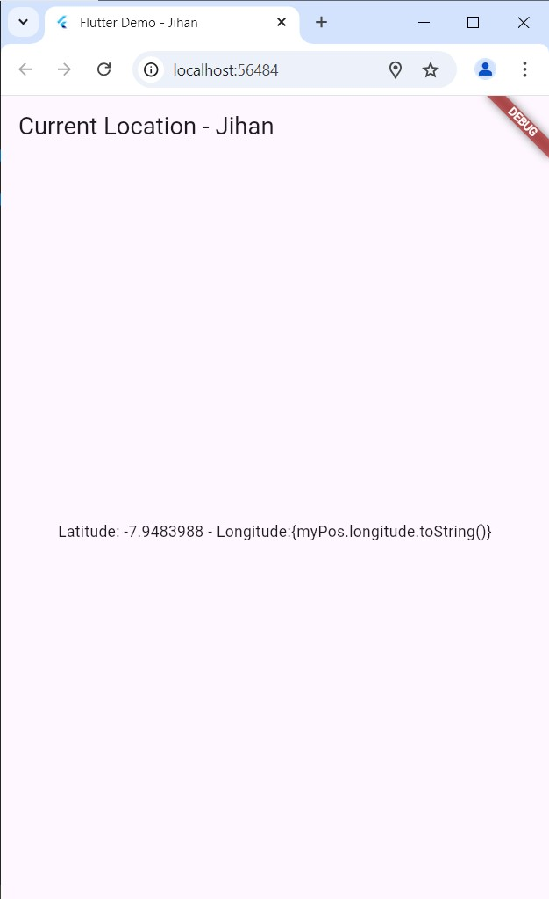 

## Praktikum 7: Manajemen Future dengan FutureBuilder

#### Soal 13
Apakah ada perbedaan UI dengan praktikum sebelumnya? Mengapa demikian?
- Jawab:<br>
Ya, ada perbedaan UI. Dengan menggunakan FutureBuilder, UI dapat merespons status dari Future secara otomatis. Jika data sedang dimuat, FutureBuilder akan menampilkan CircularProgressIndicator. Setelah data tersedia, UI akan menampilkan posisi pengguna tanpa perlu memanggil setState(), yang membuatnya lebih efisien dan lebih bersih.

  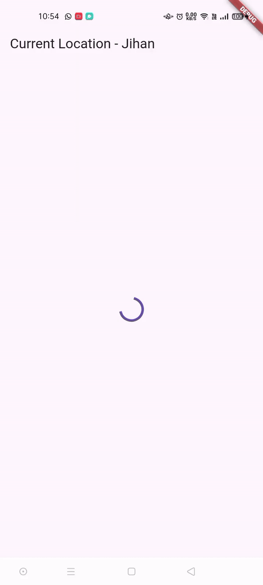 

#### Soal 14
Apakah ada perbedaan UI dengan langkah sebelumnya? Mengapa demikian?
- Jawab:<br>
 Iya, dengan penambahan handling error, UI kini lebih robust. Jika terjadi kesalahan saat mendapatkan posisi, pengguna akan mendapatkan umpan balik berupa pesan yang menjelaskan bahwa ada masalah, alih-alih hanya menampilkan data kosong. Ini meningkatkan interaksi dan pemahaman pengguna terhadap keadaan aplikasi.

  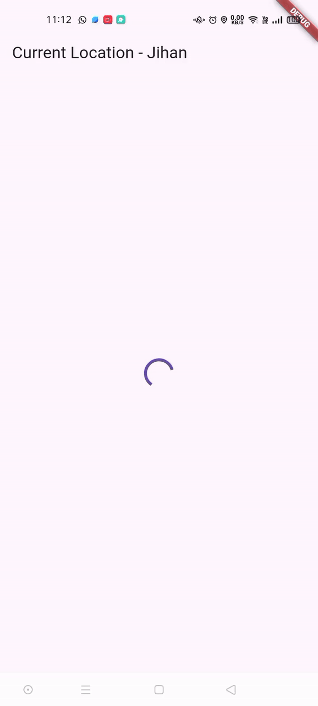 

## Praktikum 8: Navigation route dengan Future Function

#### Soal 15
```dart
import 'package:flutter/material.dart';

class NavigationFirst extends StatefulWidget {
  const NavigationFirst({super.key});

  @override
  State<NavigationFirst> createState() => _NavigationFirstState();
}

class _NavigationFirstState extends State<NavigationFirst> {
  Color color = Colors.blue.shade700;

  @override
  Widget build(BuildContext context) {
    return Scaffold(
      backgroundColor: color,
      appBar: AppBar(
        title: const Text('Navigation First Screen - Jihan'),
      ),
      body: Center(
        child: ElevatedButton(
          child: const Text('Change Color'),
          onPressed: () {
            _navigateAndGetColor(context);
          },
        ),
      ),
    );
  }
}
```

#### Soal 16
1. Cobalah klik setiap button, apa yang terjadi ? Mengapa demikian ?
- Jawab:<br>
Saat tombol "Change Color" diklik, aplikasi mengubah warna latar belakang layar menjadi warna lain secara acak atau sesuai urutan tertentu. Setiap klik memicu perubahan warna yang terlihat di layar. Perubahan warna latar belakang ini kemungkinan disebabkan oleh sebuah fungsi yang dipanggil setiap kali tombol "Change Color" ditekan. Fungsi tersebut mungkin menggunakan metode seperti `setState()` (jika Anda menggunakan Flutter) untuk memperbarui tampilan dengan warna yang berbeda. Setiap kali `setState()` dipanggil, layar akan dirender ulang dengan nilai baru, yaitu warna yang telah diperbarui.

   

2. Gantilah 3 warna pada langkah 5 dengan warna favorit Anda!

     

## Praktikum 9: Memanfaatkan async/await dengan Widget Dialog

#### Soal 17
1. Cobalah klik setiap button, apa yang terjadi ? Mengapa demikian ?
- Jawab:<br>
Saat Anda mengklik setiap tombol warna dalam dialog (red, Green, atau blue), warna latar belakang layar akan berubah sesuai warna yang dipilih. Setiap tombol mengubah nilai variabel color melalui setState, yang menyebabkan UI diperbarui dengan warna baru. Setelah warna diubah, `Navigator.pop(context);` menutup dialog, memperlihatkan latar belakang yang sudah diperbarui.

    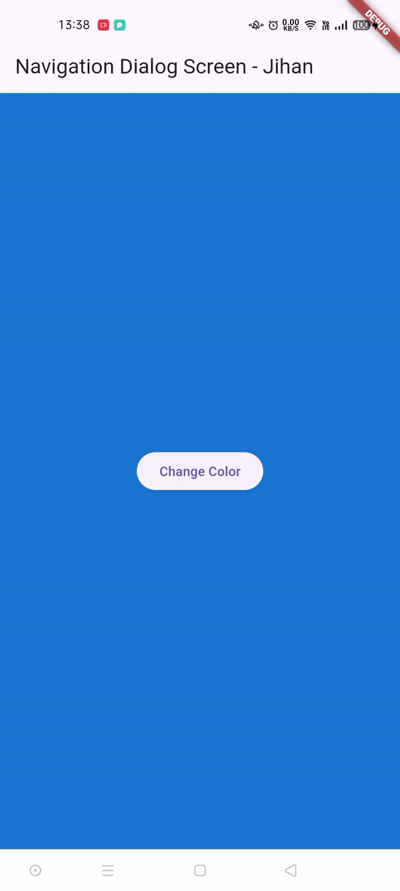 

2. Gantilah 3 warna pada langkah 3 dengan warna favorit Anda!

     