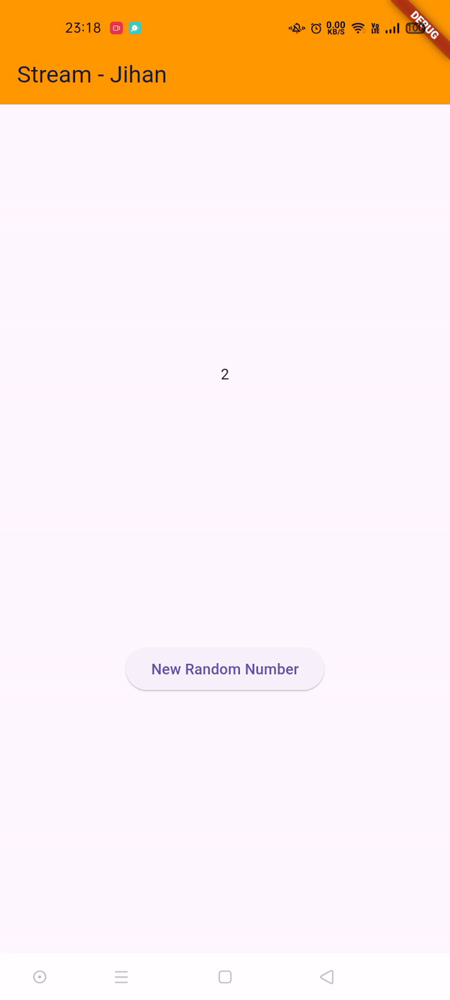
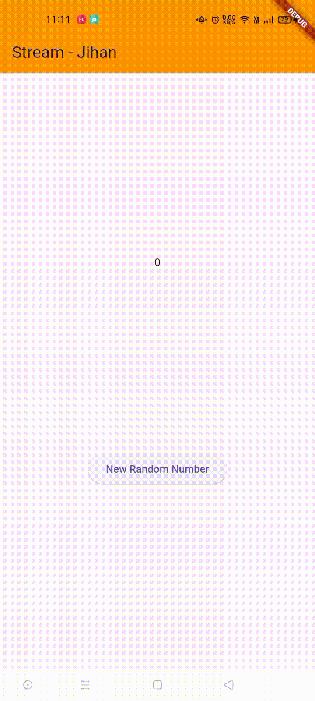

### Jihan Karunia Putri <br> 2241720031 / 13 / TI-3B

# Lanjutan State Management dengan Streams
## Praktikum 1: Dart Streams
#### Soal 1 
1. Tambahkan nama panggilan Anda pada title app sebagai identitas hasil pekerjaan Anda.
2. Gantilah warna tema aplikasi sesuai kesukaan Anda.
- Jawab:<br>
```dart
import 'package:flutter/material.dart';

void main() {
  runApp(const MyApp());
}

class MyApp extends StatelessWidget {
  const MyApp({super.key});

  @override
  Widget build(BuildContext context) {
    return MaterialApp(
      title: 'Stream - Jihan',
      theme: ThemeData(primarySwatch: Colors.deepPurple),
      home: const StreamHomePage(),
    );
  }
}

class StreamHomePage extends StatefulWidget {
  const StreamHomePage({super.key});

  @override
  State<StreamHomePage> createState() => _StreamHomePage();
}

class _StreamHomePage extends State<StreamHomePage> {
  @override
  Widget build(BuildContext context) {
    return Container();
  }
}
```

#### Soal 2
Tambahkan 5 warna lainnya sesuai keinginan Anda pada variabel colors tersebut.
- Jawab:<br>
```dart
import 'package:flutter/material.dart';

class ColorStream {
  final List<Color> colors = [
    Colors.blueGrey,
    Colors.amber,
    Colors.deepPurple,
    Colors.lightBlue,
    Colors.teal,
    Colors.indigoAccent,
    Colors.lime,
    Colors.cyan,
    Colors.green,
    Colors.orange
  ];
}
```

#### Soal 3
1. Jelaskan fungsi keyword yield* pada kode tersebut!
- Jawab:<br>
Keyword `yield*` dalam kode tersebut digunakan untuk meneruskan seluruh aliran data dari `Stream.periodic` ke dalam aliran getColors. Dengan `yield*`, semua elemen yang dihasilkan oleh `Stream.periodic` dapat langsung dikeluarkan oleh getColors tanpa perlu menggunakan yield berulang kali.<br>

2. Apa maksud isi perintah kode tersebut?
- Jawab:<br>
Kode tersebut membuat kelas ColorStream yang menyediakan aliran warna secara periodik. Fungsi `getColors()` mengembalikan Stream yang menghasilkan warna baru setiap satu detik dari daftar colors. Dengan menggunakan `Stream.periodic` dan operasi modulus pada indeks, fungsi ini mengeluarkan warna-warna dalam urutan yang berulang dari daftar colors, sehingga setiap detik satu warna baru dipancarkan sesuai urutan dalam daftar.

#### Soal 4
Capture hasil praktikum Anda berupa GIF dan lampirkan di README.


#### Soal 5
Jelaskan perbedaan menggunakan listen dan await for (langkah 9) !
- Jawab:<br>
`await for` menunggu setiap elemen dari Stream secara berurutan dalam loop asynchronous dan akan menunggu hingga aliran selesai. Cocok digunakan jika perlu menunggu semua data selesai diterima.<br>
`listen` menambahkan listener yang langsung menjalankan kode setiap kali elemen baru muncul, tanpa menunggu aliran selesai. Ini lebih sesuai untuk pembaruan real-time, seperti memperbarui UI secara langsung di Flutter.

## Praktikum 2: Stream controllers dan sinks

#### Soal 6
1. Jelaskan maksud kode langkah 8 dan 10 tersebut!
- Jawab:<br>
Langkah 8: Kode ini menginisialisasi aliran (stream) di dalam `initState()`. Objek numberStream dibuat sebagai instans dari NumberStream, dan numberStreamController diambil dari controller dalam numberStream. Selanjutnya, didapatkan aliran dari numberStreamController.stream. Kemudian, listen dipanggil pada aliran tersebut untuk menerima setiap nilai event yang masuk, dan memanggil `setState()` untuk memperbarui nilai lastNumber dengan nilai terbaru yang dikirim melalui stream. Hal ini memungkinkan pembaruan otomatis pada UI setiap kali ada angka baru dalam stream.<br>
Langkah 10: Method `addRandomNumber()` menambahkan angka acak ke dalam stream. Pertama, sebuah angka acak (myNum) antara 0 hingga 9 dihasilkan menggunakan `Random().nextInt(10)`, lalu angka ini ditambahkan ke Sink dari numberStream dengan memanggil `addNumberToSink(myNum)`. Ini memungkinkan angka acak baru ditambahkan ke aliran, yang kemudian akan memicu pembaruan UI melalui listener yang sudah diatur dalam `initState()`.<br>

2. Capture hasil praktikum Anda berupa GIF dan lampirkan di README.

    

#### Soal 7
Jelaskan maksud kode langkah 13 sampai 15 tersebut!
- Jawab:<br>
**Langkah 13**: Method `addError()` ditambahkan ke dalam stream.dart untuk memasukkan error ke dalam aliran (stream) dengan menggunakan `controller.sink.addError('error')`. Dengan menambahkan error ini, dapat diuji bagaimana aplikasi merespons error yang terjadi pada stream.<br>
**Langkah 14**: Dalam main.dart, method onError ditambahkan ke listener di `initState()` untuk menangani error yang mungkin diterima dari stream. Saat error terjadi, onError akan dipanggil, dan setState memperbarui lastNumber menjadi -1. Hal ini memungkinkan UI untuk menampilkan indikator khusus saat error terjadi dalam aliran.<br>
**Langkah 15**: Method `addRandomNumber()` diedit untuk mengganti fungsinya dari mengirim angka acak menjadi memicu error ke dalam stream. Dua baris kode yang menambahkan angka acak dikomentari, dan sebagai gantinya, `numberStream.addError()` dipanggil. Ini mensimulasikan error saat `addRandomNumber()` dijalankan, sehingga dapat diuji bagaimana aplikasi merespons error dalam stream.

## Praktikum 3: Injeksi data ke streams

#### Soal 8
Jelaskan maksud kode langkah 1-3 tersebut!
- Jawab:<br>
**Langkah 1**<br>
Menambahkan variabel transformer di dalam class `_StreamHomePageState` untuk menyimpan `StreamTransformer`. late menandakan bahwa variabel ini akan diinisialisasi nanti.<br>
**Langkah 2**<br>
Inisialisasi transformer di dalam initState dengan `StreamTransformer<int, int>.fromHandlers`, yang memiliki fungsi:
  - `handleData`: Mengalikan setiap nilai yang masuk dari stream dengan 10.
  - `handleError`: Mengirimkan nilai -1 jika ada error di stream.
  - `handleDone`: Menutup stream saat selesai.<br>
  
  **Langkah 3**<br>
  Menerapkan transformer pada stream dan memantau hasilnya:
    - listen: Setiap event hasil transformasi disimpan di lastNumber, lalu UI diperbarui dengan `setState`.
    - onError: Jika terjadi error, lastNumber diset ke -1, dan UI juga diperbarui dengan `setState`. <br>

  Dengan ini, setiap nilai dari stream diubah dan ditampilkan, serta error dapat ditangani.

    
