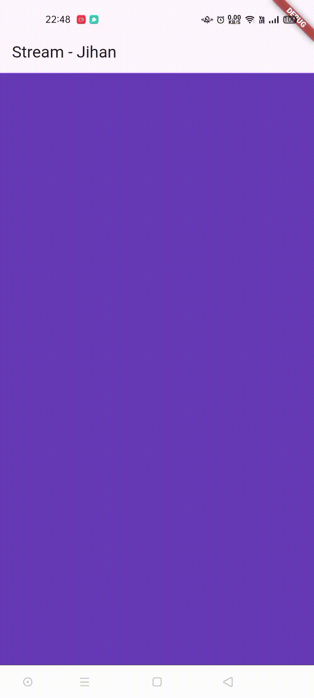

### Jihan Karunia Putri <br> 2241720031 / 13 / TI-3B

# Lanjutan State Management dengan Streams
## Praktikum 1: Dart Streams
#### Soal 1 
1. Tambahkan nama panggilan Anda pada title app sebagai identitas hasil pekerjaan Anda.
2. Gantilah warna tema aplikasi sesuai kesukaan Anda.
- Jawab:<br>
```dart
import 'package:flutter/material.dart';

void main() {
  runApp(const MyApp());
}

class MyApp extends StatelessWidget {
  const MyApp({super.key});

  @override
  Widget build(BuildContext context) {
    return MaterialApp(
      title: 'Stream - Jihan',
      theme: ThemeData(primarySwatch: Colors.deepPurple),
      home: const StreamHomePage(),
    );
  }
}

class StreamHomePage extends StatefulWidget {
  const StreamHomePage({super.key});

  @override
  State<StreamHomePage> createState() => _StreamHomePage();
}

class _StreamHomePage extends State<StreamHomePage> {
  @override
  Widget build(BuildContext context) {
    return Container();
  }
}
```

#### Soal 2
Tambahkan 5 warna lainnya sesuai keinginan Anda pada variabel colors tersebut.
- Jawab:<br>
```dart
import 'package:flutter/material.dart';

class ColorStream {
  final List<Color> colors = [
    Colors.blueGrey,
    Colors.amber,
    Colors.deepPurple,
    Colors.lightBlue,
    Colors.teal,
    Colors.indigoAccent,
    Colors.lime,
    Colors.cyan,
    Colors.green,
    Colors.orange
  ];
}
```

#### Soal 3
1. Jelaskan fungsi keyword yield* pada kode tersebut!
- Jawab:<br>
Keyword `yield*` dalam kode tersebut digunakan untuk meneruskan seluruh aliran data dari `Stream.periodic` ke dalam aliran getColors. Dengan `yield*`, semua elemen yang dihasilkan oleh `Stream.periodic` dapat langsung dikeluarkan oleh getColors tanpa perlu menggunakan yield berulang kali.<br>

2. Apa maksud isi perintah kode tersebut?
- Jawab:<br>
Kode tersebut membuat kelas ColorStream yang menyediakan aliran warna secara periodik. Fungsi `getColors()` mengembalikan Stream yang menghasilkan warna baru setiap satu detik dari daftar colors. Dengan menggunakan `Stream.periodic` dan operasi modulus pada indeks, fungsi ini mengeluarkan warna-warna dalam urutan yang berulang dari daftar colors, sehingga setiap detik satu warna baru dipancarkan sesuai urutan dalam daftar.

#### Soal 4
Capture hasil praktikum Anda berupa GIF dan lampirkan di README.



#### Soal 5
Jelaskan perbedaan menggunakan listen dan await for (langkah 9) !
- Jawab:<br>
`await for` menunggu setiap elemen dari Stream secara berurutan dalam loop asynchronous dan akan menunggu hingga aliran selesai. Cocok digunakan jika perlu menunggu semua data selesai diterima.<br>
`listen` menambahkan listener yang langsung menjalankan kode setiap kali elemen baru muncul, tanpa menunggu aliran selesai. Ini lebih sesuai untuk pembaruan real-time, seperti memperbarui UI secara langsung di Flutter.