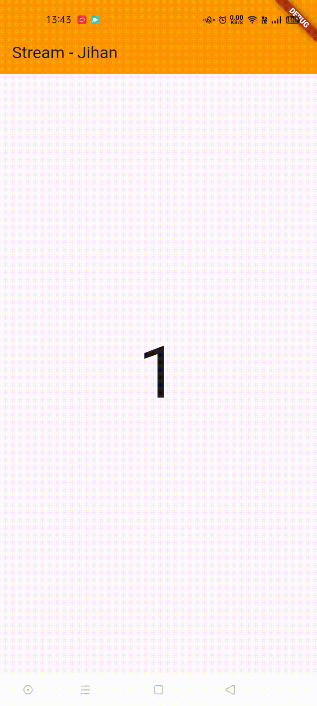

### Jihan Karunia Putri   2241720031 / 13 / TI-3B

# Lanjutan State Management dengan Streams
## Praktikum 6: StreamBuilder
#### Soal 12
Jelaskan maksud kode pada langkah 3 dan 7 !
- Jawab: 
**Langkah 3**, di dalam class NumberStream, metode getNumber dibuat untuk menghasilkan stream angka acak menggunakan Stream.periodic, yang memicu event setiap satu detik. Di setiap event, angka acak antara 0 hingga 9 dibuat menggunakan Random dan dikirimkan melalui stream.  
**Langkah 7**, di dalam build, Scaffold ditampilkan dengan AppBar dan StreamBuilder di body. StreamBuilder ini mendengarkan stream numberStream dan memperbarui UI setiap kali ada data baru. Jika snapshot memiliki data, angka tersebut ditampilkan di tengah layar dalam ukuran teks besar. Jika terjadi error dalam stream, pesan “Error!” akan dicetak di log console.

  