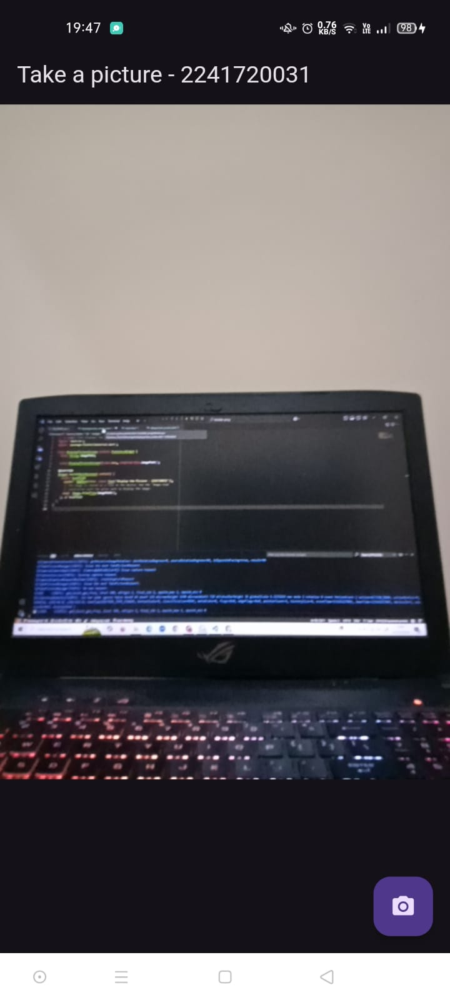
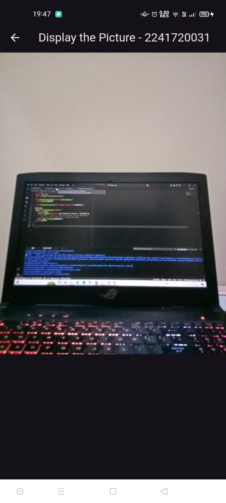

### Jihan Karunia Putri <br> 13 / 2241720031 / TI-3B

# KAMERA

## Praktikum 1: Mengambil Foto dengan Kamera di Flutter
#### Langkah 2: Tambah dependensi yang diperlukan


#### Langkah 3: Ambil Sensor Kamera dari device
```dart
import 'package:camera/camera.dart';
import 'package:flutter/material.dart';

Future<void> main() async {
  // Ensure that plugin services are initialized so that `availableCameras()`
  // can be called before `runApp()`
  WidgetsFlutterBinding.ensureInitialized();

  // Obtain a list of the available cameras on the device.
  final cameras = await availableCameras();

  // Get a specific camera from the list of available cameras.
  final firstCamera = cameras.first;

    runApp(MyApp(camera: firstCamera));
}
```

#### Langkah 4: Buat dan inisialisasi CameraController
lib/widget/takepicture_screen.dart
```dart
import 'package:camera/camera.dart';
import 'package:flutter/material.dart';

// A screen that allows users to take a picture using a given camera.
class TakePictureScreen extends StatefulWidget {
  const TakePictureScreen({
    super.key,
    required this.camera,
  });

  final CameraDescription camera;

  @override
  TakePictureScreenState createState() => TakePictureScreenState();
}

class TakePictureScreenState extends State<TakePictureScreen> {
  late CameraController _controller;
  late Future<void> _initializeControllerFuture;

  @override
  void initState() {
    super.initState();
    // To display the current output from the Camera,
    // create a CameraController.
    _controller = CameraController(
      // Get a specific camera from the list of available cameras.
      widget.camera,
      // Define the resolution to use.
      ResolutionPreset.medium,
    );

    // Next, initialize the controller. This returns a Future.
    _initializeControllerFuture = _controller.initialize();
  }

  @override
  void dispose() {
    // Dispose of the controller when the widget is disposed.
    _controller.dispose();
    super.dispose();
  }

  @override
  Widget build(BuildContext context) {
    // Fill this out in the next steps.
    return Container();
  }
}
```
#### Langkah 5: Gunakan CameraPreview untuk menampilkan preview foto
Menggunakan widget CameraPreview dari package camera untuk menampilkan preview foto. Dan perlu tipe objek void berupa FutureBuilder untuk menangani proses async.<br>
```dart
  @override
  Widget build(BuildContext context) {
    return Scaffold(
      appBar: AppBar(title: const Text('Take a picture - 2241720031')),
      // You must wait until the controller is initialized before displaying the
      // camera preview. Use a FutureBuilder to display a loading spinner until the
      // controller has finished initializing.
      body: FutureBuilder<void>(
        future: _initializeControllerFuture,
        builder: (context, snapshot) {
          if (snapshot.connectionState == ConnectionState.done) {
            // If the Future is complete, display the preview.
            return CameraPreview(_controller);
          } else {
            // Otherwise, display a loading indicator.
            return const Center(child: CircularProgressIndicator());
          }
        },
      ),
    );
  }
```
#### Langkah 6: Ambil foto dengan CameraController
lib/widget/takepicture_screen.dart setelah field body.<br>
```dart
  floatingActionButton: FloatingActionButton(
    // Provide an onPressed callback.
    onPressed: () async {
      // Take the Picture in a try / catch block. If anything goes wrong,
      // catch the error.
      try {
        // Ensure that the camera is initialized.
        await _initializeControllerFuture;

        // Attempt to take a picture and then get the location
        // where the image file is saved.
        final image = await _controller.takePicture();
      } catch (e) {
        // If an error occurs, log the error to the console.
         print(e);
       }
     },
    child: const Icon(Icons.camera_alt),
  ),
```
#### Langkah 7: Buat widget baru DisplayPictureScreen
lib/widget/displaypicture_screen.dart
```dart
// A widget that displays the picture taken by the user.
import 'dart:io';
import 'package:flutter/material.dart';

class DisplayPictureScreen extends StatelessWidget {
  final String imagePath;

  const DisplayPictureScreen({super.key, required this.imagePath});

  @override
  Widget build(BuildContext context) {
    return Scaffold(
      appBar: AppBar(title: const Text('Display the Picture - NIM Anda')),
      // The image is stored as a file on the device. Use the `Image.file`
      // constructor with the given path to display the image.
      body: Image.file(File(imagePath)),
    );
  }
}
```
#### Langkah 8: Edit main.dart
lib/main.dart
```dart
  runApp(
    MaterialApp(
      theme: ThemeData.dark(),
      home: TakePictureScreen(
        // Pass the appropriate camera to the TakePictureScreen widget.
        camera: firstCamera,
      ),
      debugShowCheckedModeBanner: false,
    ),
  );
```
#### Langkah 9: Menampilkan hasil foto
Menambahkan kode pada bagian try / catch agar dapat menampilkan hasil foto pada DisplayPictureScreen.
```dart
try {
    // Ensure that the camera is initialized.
    await _initializeControllerFuture;

    // Attempt to take a picture and get the file `image`
    // where it was saved.
    final image = await _controller.takePicture();

    if (!context.mounted) return;

    // If the picture was taken, display it on a new screen.
    await Navigator.of(context).push(
      MaterialPageRoute(
        builder: (context) => DisplayPictureScreen(
          // Pass the automatically generated path to
          // the DisplayPictureScreen widget.
          imagePath: image.path,
        ),
      ),
    );
  } catch (e) {
    // If an error occurs, log the error to the console.
    print(e);
  }
```

#### Hasil pada deploy pada device (Smartphone)
**Hasil take picture**<br>


**Hasil display picture**<br>

